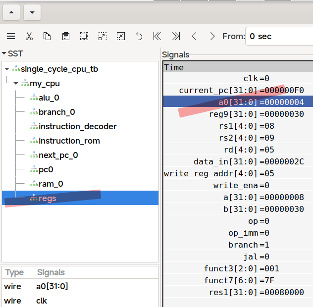

# simple rv
## 如何测试模块

- 安装 iverilog 和 gtkwave
- 参考 `alu_tb.v` ，写一个测试文件。
- 编译： `iverilog -o alu_tb ./alu_tb.v alu.v`
  - 编译单周期 CPU 的命令： `iverilog ./single_cycle_cpu_tb.v -y . -o single_cycle_cpu_tb`
- 运行，并生成波形图： `./alu_tb`
  - 注意，运行时序电路时，需要使用命令 `vvp -n reg_tb -vcd` 来生成波形图
- 使用 gtkwave 打开生成的波形图文件： `open alu_wave.vcd`
- 检查波形是否正确，即可

## 如何整体测试

### 准备程序

- 找一个 asm, 注释掉所有 ecall
- 用 rars 打开 asm, 编译，dump memory
- 修改 `rom.v` 里面的文件路径
- 编译： `iverilog ./single_cycle_cpu_tb.v -y . -o single_cycle_cpu_tb`
- 仿真： `vvp -n single_cycle_cpu_tb -vcd`

查看波形时， a0 的值即为的 LED 的值

### 编译 C 程序

```
clang -T app.lds --target=riscv32-unknown-unknown ./test.c -march=rv32im -ffreestanding -fno-builtin -nostdlib  -mno-relax -fno-PIE -G=0
llvm-objcopy ./a.out --dump-section .text=test_rom.bin --dump-section .data=test_ram.bin 
od -w4 -An --endian little -v -t x4 ./test_rom.bin > test_rom.hex
od -w4 -An --endian little -v -t x4 ./test_ram.bin > test_ram.hex
```
